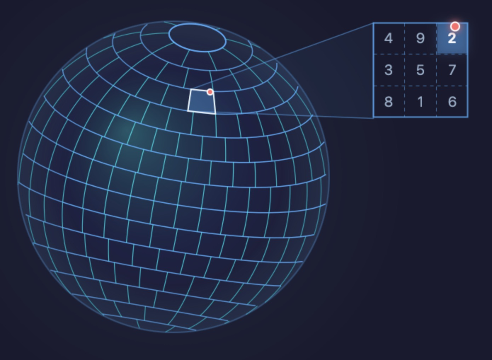

# F9Grid

真正抗 GPS 漂移的地理网格系统 —— 漂移 ≤11.8m 时，即使在网格边缘反复测量也必得相同网格 ID。

3000 亿格子，39-bit 高熵，稳定可靠，天然地理密钥。

[English](README.md)

<p align="center">
  
</p>

<p align="center"><em>网格接近正方形，同纬度形状完全一致。每格划分九宫格方位码 (1-9) 实现漂移纠正。</em></p>

## 概述

由于目前所有的网格系统都存在各种问题，不是形状不规则，就是面积相差大，或者一些区域畸变非常明显，鱼和熊掌不可兼得。目前市面上没有形状规则，同时抗 GPS 偏移的网格系统。

F9Grid 是在 PlusCode 的 10 位码网格基础上研发改进扩展的网格系统。鉴于 PlusCode 的经纬度网格换算足够简单易用，同时形状非常规整，F9Grid 对其做了扩展：将高纬度网格沿经度方向做适当合并，同时保持同一纬度的网格大小一样，尽量使网格面积接近标准格面积。

## 特性

- **规则形状**：所有网格都是矩形（极点除外）
- **抗 GPS 漂移**：通过方位码可纠正最多约 11.8 米的 GPS 漂移
- **PlusCode 兼容**：网格线始终与 10 位 PlusCode 网格线对齐
- **面积均衡**：所有网格目标面积约 1730.963 m²（误差 ±14.2857%）
- **高精度计算**：内部使用 Decimal 避免浮点精度误差

## 系统要求

- Swift 5.0+
- iOS 12.0+ / macOS 10.13+ / tvOS 12.0+ / watchOS 4.0+

## 安装

### Swift Package Manager

在 `Package.swift` 中添加：

```swift
dependencies: [
    .package(url: "https://github.com/Forgetless/F9Grid.git", from: "1.0.0")
]
```

或在 Xcode 中：File → Add Package Dependencies → 输入仓库 URL。

## 快速开始

```swift
import F9Grid

// 将坐标转换为 F9Grid 网格
let cell = F9Grid.cell(lat: "31.239696", lng: "121.499809")
print(cell?.index)  // 网格索引

// 将索引转换回网格
let cellFromIndex = F9Grid.cell(index: 12345678)
print(cellFromIndex?.centerLat, cellFromIndex?.centerLng)

// 获取方位码用于 GPS 漂移纠正
let positionCode = cell?.positionCode(lat: Decimal(string: "31.239696")!,
                                       lng: Decimal(string: "121.499809")!)

// GPS 漂移后找回原始网格
let originalIndex = F9Grid.findOriginalCell(lat: "31.239700", lng: "121.499812",
                                             originalPositionCode: positionCode!)
```

## 网格体系

- **标准**：WGS-84 椭球体
- **基本单位**：0.000125°（与 PlusCode 10 位码相同）
- **纬度步长**：0.000375°（3 个基本单位）
- **经度步长**：0.000125° × k（随纬度变化）
- **网格总数**：300,626,092,560
- **索引范围**：0（北极点）到 300,626,092,559（南极点）
- **边界规则**：所有范围采用 `[low, up)` 左闭右开区间
  - 纬度：`[south, north)` 南边界包含，北边界不包含
  - 经度：`[west, east)` 西边界包含，东边界不包含
  - 北极点：`[89.999625°, 90°]` 特殊情况，包含最大纬度
  - 南极点：`[-90°, -89.999625°)` 遵循左闭右开规则

### 九宫格方位码

```
4(西北) 9(北)  2(东北)
3(西)   5(中)  7(东)
8(西南) 1(南)  6(东南)
```

方位码实现漂移纠正——通过漂移后的坐标加上原始方位码可以找回原始网格。

### k 值说明

由于高纬度带来的 PlusCode 严重变窄，在纬度方向长度几乎不变的情况下，尽量保持格子面积接近标准格面积。算出不同纬度不同的经度步长，0.000125 × k = 经度步长，同时 k 必须能整除 2880000 = 2⁹ × 3² × 5⁴（保证 F9Grid 格子始终和 10 位 PlusCode 线重合）。

### 网格尺寸

| 方向 | 尺寸 | 说明 |
|------|------|------|
| 南北 | ~41.5 米 | 固定 0.000375°，全球一致 |
| 东西 | ~41.7 米 (k=3) | 赤道附近标准格 |
| 东西 | 随纬度调整 | 高纬度合并保持面积 |

### 抗漂移能力

F9Grid 通过九宫格方位码实现精确的 GPS 漂移纠正：

| 指标 | 数值 | 说明 |
|------|------|------|
| 最小纠偏范围 | ~11.9 米 | 保证可恢复的最小阈值（最小格宽的 1/3） |
| 最大纠偏范围 | ~42.1 米 | 对角线方向最大可恢复漂移 |
| 最大纬度纠偏 | ~27.6 米 | 南北方向（2/3 格高度，全球固定） |
| 最大经度纠偏 | ~31.8 米 | 东西方向（最大格宽的 2/3） |

**各方向纠偏范围：**

| 方向 | 最小范围 | 最大范围 | 说明 |
|------|----------|----------|------|
| 南北 | ~13.8 米 | ~27.6 米 | 1/3 至 2/3 格高度（全球固定） |
| 东西 | ~11.9 米 | ~31.8 米 | 随 k 值变化（面积误差 ±14.2857%） |

只要 GPS 漂移在最小范围（~11.9 米）内，通过原始方位码即可保证精确找回原始网格（极点附近除外）。根据漂移方向不同，最大可恢复范围可达上述最大值。

## 与其他网格系统对比

| 特性 | F9Grid | S2 | H3 | HEALPix | PlusCode |
|------|---------|----|----|---------|----------|
| **网格形状** | 矩形（接近正方形）✓ | 四边形（不规则） | 六边形 | 菱形/三角形(不规则) | 矩形（高纬度极窄） |
| **同纬度一致性** | 形状面积完全一致 ✓ | 不一致 | 不一致 | 面积完全相等 | 形状一致但面积不一致 |
| **面积误差** | ±14.2857% | 110% | 99% | 等面积 | 高纬度极度变形 |
| **高纬度表现** | 自动合并保持面积尽量接近 | 严重畸变 | 相对均匀 | 均匀 | 严重变窄 |
| **抗 GPS 漂移** | ✓ 方位码纠正 | ✗ | ✗ | ✗ | ✗ |
| **坐标转换** | 简单整数运算 | 复杂 | 复杂 | 复杂 | 简单 |
| **相邻关系** | 简单（东南西北）✓ | 复杂 | 复杂 | 复杂（8邻居不规则） | 简单 |
| **极点处理** | 圆形极点格 | 奇点问题 | 五边形 | 特殊处理 | 畸变 |

### 为什么选择 F9Grid？

1. **规则形状**：贴近 WGS-84 椭球体球面，形状近似正方形，同一纬度的所有网格形状和面积完全一致。不同纬度之间最大面积误差仅为 ±14.2857%，远优于 PlusCode（高纬度极度变形）、S2（110%）和 H3（99%）
2. **相邻关系**：东南西北各个方向相邻关系十分简单，优于 HEALPix 和 H3
3. **抗漂移能力**：独有的方位码机制，最小纠偏 ~11.9 米，最大纠偏可达 ~42.1 米，精确还原原始网格
4. **高纬度友好**：自动合并高纬度网格，避免 PlusCode 的严重变窄问题，高纬度误差极小只在纬度31和64时误差最大
5. **简单高效**：基于整数运算，无需复杂的球面几何计算，边界清晰

## API 参考

### `F9Grid.cell(lat:lng:) -> F9Cell?`

将经纬度转换为 F9Grid 网格。

- **参数**：`lat`、`lng` 为 String 或 Decimal
- **返回**：`F9Cell`，包含索引、方位码、中心坐标和网格信息

### `F9Grid.cell(index:) -> F9Cell?`

将 F9Grid 索引转换为网格。

- **参数**：`index` 为 Int64（0 = 北极点，300626092559 = 南极点）
- **返回**：`F9Cell`，包含中心坐标和网格信息

### `F9Grid.findOriginalCell(lat:lng:originalPositionCode:) -> Int64?`

根据当前坐标和原始方位码找回原始网格索引。

- **参数**：当前 `lat`、`lng` 和 `originalPositionCode`（1-9）
- **返回**：原始网格索引

### `F9Cell` 属性

| 属性 | 类型 | 说明 |
|------|------|------|
| `index` | `Int64` | 全局网格索引 |
| `k` | `Int` | 经度步长倍数 |
| `step` | `Int` | 纬度步数 |
| `latRange` | `(south: Double, north: Double)` | 纬度边界 [南, 北) |
| `lngRange` | `(west: Double, east: Double)` | 经度边界 [西, 东) |
| `centerLat` | `Double` | 中心纬度 |
| `centerLng` | `Double` | 中心经度（归一化到 [-180, 180)） |
| `isPole` | `Bool` | 是否为极点 |

### `F9Cell` 协议

- **Equatable**：相同索引的网格相等
- **Hashable**：可用于 Set 或作为 Dictionary 键

## PlusCode 集成

F9Grid 支持从 PlusCode 创建网格：

```swift
// 从 10 位 PlusCode 创建网格
let cell = F9Grid.cell(plusCode: "85HRJX6P+JX")

// 支持带 + 号或空格的 PlusCode
let cell2 = F9Grid.cell(plusCode: "85HR JX6P+JX")
```

## 技术规范

如需在其他编程语言中实现 F9Grid，请参阅完整的技术规范文档：

- [F9Grid 技术规范](Spec/F9Grid_Specification_zh.md)
- [F9Grid Specification (English)](Spec/F9Grid_Specification.md)
